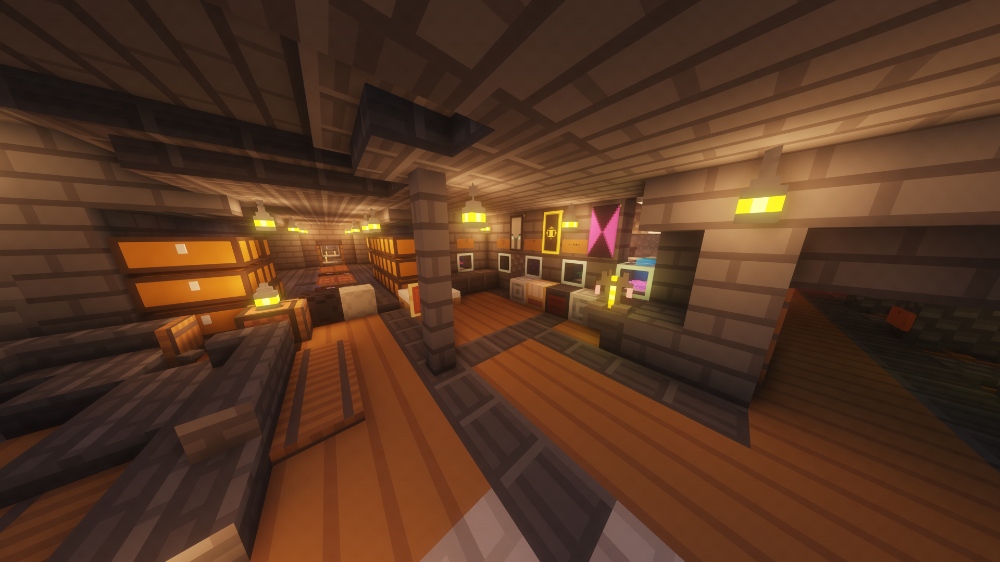

# 服务器阵营（十一周目）

## zuogeren派

尼比鲁人数最众多的派系。

成员：zuogeren、elon2008、Java_man、AlanLiu09、aza0、ylyn、end、last

此派系拥有实时监控所有玩家坐标、使用重锤平砍打出超过100点伤害等科技。

此派系默认友好，但和xiaoUI派结盟会导致其态度转为敌对。

基地影像：

## hghgjk派

尼比鲁势力第二大的派系。

成员：hghgjk、langmao07

hghgjk精通生电科技，并且经常建造与启动巨大规模的生电机器，导致服务器TPS严重下降。

2024年10月4日，hghgjk发生了技术爆炸，大量zuogeren派的科技被其掌握。

基地影像：

## BANIJJ派

成员：BANIJJ、nightmare05、MuneRaul

MuneRaul在基地被圈后一段时间投奔了BANIJJ。

基地影像：

## xiaoUI派

主条目：[xiaoUI派](UI/index.md)

和服务器超过半数的玩家敌对的派系。其成员xiaoUI擅长在不被察觉的情况下在服务器进行破坏行动（如将其他玩家未圈地的基地圈起、盗取物品等）、诱骗其他玩家与其结盟并在一段时间后背刺，因此激怒了大量玩家。

成员：xiaoUI、hite404

xiaoUI被zuogeren派列为头号追杀目标，并且已经被zuogeren、Java_man击杀了很多遍，但是每次都能东山再起。

hite404因为后期没有破坏行为，没有被继续追杀。

## MuneRaul派（已解散）

成员：MuneRaul、BANIJJ

2024年9月，MuneRaul的基地因为没有圈地，被xiaoUI圈为己有。MuneRaul派遭受重大损失，随即解散。

前基地影像（已被圈）：

## lllllliuzeyuan派

成员：lllllliuzeyuan、himyyds

在zuogeren的帮助下发展，并且zuogeren为基地帮助了圈地。

基地影像：

