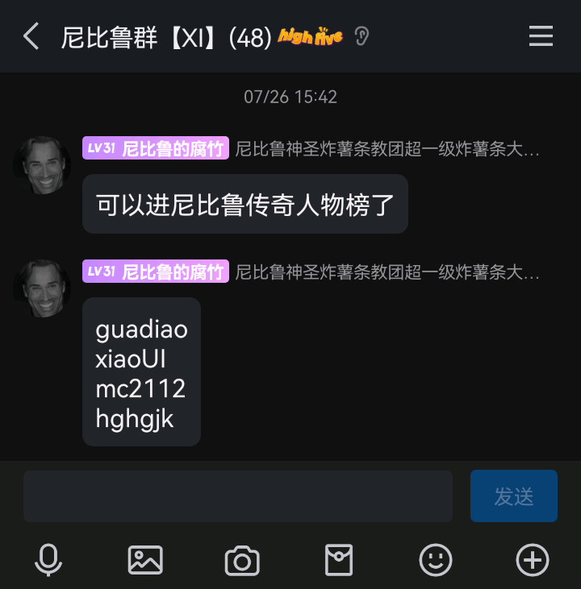

* toc
{:toc}

# 服务器知名典故

本页面收录服务器的知名典故。

## 腐竹官方认证传奇人物

## hghgjk与Caz1xcany的恨仇

起因：hghgjk的小号在4周目刷死亡数时，Caz1xcany把hghgjk的小号投放到数万格，而且腐竹整烂活给与小号无敌的效果，不死不灭。因为Caz1xcany这个行为让挂机的时间白白浪费，而且还回不去出生地，导致hghgjk扬言用不死不灭的身躯打Caz1xcany。待到hghgjk的小号找到Caz1xcany，Caz1xcany看到hghgjk小号一千多的血量，先是打了2下(确信)，但是知道不敌，于是落荒而逃（其实腐竹在遇到Caz1xcany时就把hghgjk的小号血量调为正常）。Caz1xcany心里想着：“hghgjk看到我逃跑的方向了，我们基地岌岌可危，此子断不可留！”，于是Caz1xcany联合xiaoan（hghgjk的同伴）把hghgjk家用多只凋灵毁于一旦。

*注：caz始终没被打到。*

经过：hghgjk刚开始并没有做什么，而是要求Caz1xcany击杀凋灵，仅此而已，但Caz1xcany不为所动。于是hghgjk与QiLin一起重整旗鼓准备报仇，在其中与Caz1xcany多次对打，但Caz1xcany PVP始终占下风，可是总体来讲Caz1xcany占上风，Caz1xcany巧妙利用水晶和黑曜石轰炸hghgjk。在又一次战斗中，QiLin孤身一人单挑Caz1xcany，可终究实力不行，被打得毫无还手之力，只好逃回家。可Caz1xcany看着QiLin逃跑的身影心中早已笑出了声..……待hghgjk回到家，映入眼帘的是满目疮痍！同样地，3只凋灵徘徊在空中——Caz1xcany又来了！hghgjk在搬家的过程中发现MuneRaul家的大量物资，于是毫不留情地全部偷走。待MuneRaul发现时，却说了一句：“我们联合。”于是复仇小队人有：hghgjk、QiLin、MuneRaul、java21、tungangjing等。可突然一天，4周目硬盘直接爆炸，腐竹并没有备份，导致被迫开启新的周目。

事情并没有因此而结束，此后5周目hghgjk对Caz1xcany表面扬言和好，可心中仍然怒火中烧。5，6周目Caz1xcany并没有参与游玩。直到6.5空岛周目，Caz1xcany终于再次出现，而此时，hghgjk已经掌握了毁灭他人空岛的方法。Caz1xcany的基地因此终于被hghgjk化为废墟！此后的所有周目Caz1xcany虽然并没有长时间游玩，但还是被hghgjk针对。在8周目时，hghgjk的复仇欲望达到癫狂的状态，凡是与Caz1xcany有关系的都被hghgjk针对，如：“zuogeren帮助过Caz1xcany，所以我要报仇！”，“腐竹在我遇到Caz1xcany时帮助 Caz1xcany调我血量，我要报仇！”，“服务器是腐竹的，而腐竹帮助过Caz1xcany，所以我要卡服！”。于是癫狂的复仇者hghgjk用TNT把zuogeren的基地破坏，可zuogeren乃服务器最强大的势力，于是hghgjk家被zuogeren用三体科技报复毁灭。Caz1xcany原话：“别人报仇的针对，你是霰弹枪。”

结果：Caz1xcany再也没有来过服务器，在群里也很少发言（发言都是在抱怨hghgjk），但大概率不是hghgjk的原因。

## Jane

Jane（简）是来自外国的14岁女性中国留学生，身份神秘。自从Jane来到服务器，就在hghgjk家的山坡上建泥土小人，后来围着hghgjk造十字架，十字架上的告示牌写着诅咒的话语。

## “不玩了”“那今天尼比鲁关服”

（Kelvin=腐竹，布尔什维克1992=elon2008，lolo=hghgjk，□↓↓↑=Caz1xcany）

2024年4月21日，elon2008在服务器的重生点附近圈了地，导致腐竹生气，并惩罚了elon2008，移除了他的所有领地。elon2008宣称不会再玩服务器，于是腐竹突然破防，宣布“那今天尼比鲁关服”，随后关闭服务器并解散了原群聊，将加了自己的QQ好友的服务器玩家全部拉黑，隐退了近两个月才重新出现。

此后，“不玩了”“那今天尼比鲁关服”遂成为尼比鲁名梗。

## xiaoUI传奇

xiaoUI在3周目时为非作歹，无恶不作，但是被zuogeren制裁（详情未知）。

xiaoUI在10周目前中期被zuogeren和hghgjk重新拉入新服务器群，但很显然这对于服务器多数玩家来说并不是一个好消息。初来乍到，xiaoUI并不敢做坏事，但hghgjk打算给xiaoUI来个下马威，在xiaoUI说出自己的坐标后，hghgjk借着帮助xiaoUI的名义，带着大量附魔金苹果去制裁xiaoUI。来到xiaoUI的坐标处后，hghgjk慢慢接近xiaoUI，突然hghgjk用手中的武器直直地砍向xiaoUI，xiaoUI在受惊后快速退出游戏，此时xiaoUI小号上线在出生点让hghgjk以为他用了什么手段回到出生点（没分清大号小号），导致这次制裁失败。xiaoUI嚣张地认为hghgjk不过如此，再次说出了自己的坐标。这次hghgjk不敢怠慢，快速飞去了那个坐标处，xiaoUI再次被抓住，可他再次退出服务器。hghgjk把xiaoUI下线的地方用黑曜石围了起来，在里面放满了岩浆，此时xiaoUI小号上线，hghgjk在聊天框发了：“w zuogeren 不堵他了，懒得守了，我先走了。”以骗xiaoUI上线。xiaoUI果然中计，在xiaoUI上线的一瞬间就被hghgjk击杀，于是xiaoUI被拿下一血。可xiaoUI死性不改，在与MuneRaul势力联合时背刺了MuneRaul和Java21。

此后xiaoUI被zuogeren势力针对，hghgjk与zuogeren等人联合制裁xiaoUI。

在此后的11周目，hghgjk认为讨伐xiaoUI浪费时间且毫无意义，所以几乎没在意xiaoUI，但Java_man与zuogeren依然在追杀xiaoUI，极端的Java_man甚至把新人当成xiaoUI小号杀死。

腐竹评价：

### 脑干切除术

### 400x400得4000

### 给zuogeren打视频电话

### 郑州省

### 被zuogeren等人关在末地戏耍

日期：2024年10月4日

### UI还钱记

**2025年7月21日，xiaoUI在群内发了一张和他人聊天记录的截图。**

在之后xiaoUI发的聊天记录里，还钱时间一拖再拖，最后也只还了一毛钱。

后面甚至提出了如果欠钱就直接拉黑的操作，但实际上并未拉黑，只是口嗨罢了。

xiaoUI用借来的钱买了其他东西。

吃面给不起钱继续借钱。

*截止至2025年7月26日仍未还清*

### AI领域大神

主条目：[AI领域大神](AI)

## hghgjk传奇

hghgjk在4周目中后期加入服务器，自从进入服务器就被腐竹注意，被给与[比亚迪]称号和暂时的速度效果。hghgjk在4,5,6,6.5,8,10,11周目都游玩了大量时间，可能是服务器游玩最久的人。此外hghgjk喜欢宣传服务器，刚开始发在了B站，却没人看，于是hghgjk采取了极端手段，可是被人开盒威胁。在10周目时hghgjk发了mcbbs和mcmod的宣传服务器帖子，戏剧性的是，腐竹的mcmod宣传帖并没有通过，hghgjk的却通过了。

## zuogeren传奇

zuogeren是服务器除腐竹外第一神秘的玩家，掌握服务器大量漏洞，更是在十一周目成为了三体人，拥有恐怖的三体科技。其实力和心眼深不可测。

*一周目时，zuogeren打算建造一台高速熔炉为基地成员使用。然而彼时zuogeren尚未学会使用投影。看着高速熔炉的投影那层层堆砌的结构，搁置了建设。后因基地遭受袭击，不得已而进行迁徙，高速熔炉的建设从此彻底没了后文。*

*冷知识：该高速熔炉至今仍未建成。*

## guaidao传奇

（guadiao为对其的戏称）

## Java_man传奇

Java_man是尼比鲁服务器一周目的第一个玩家。

Java_man在一周目曾跟随zuogeren，然而一次Java_man被一个玩家杀死，这个玩家霸占了Java_man的物品，甚至加入了zuogeren阵营并把Java_man排挤出去。Java_man趁机找到机会杀死了这个玩家并夺回物品，然而在和zuogeren的一次外出行动中，Java_man意外死亡，在Java_man回来之前这个玩家又给zuogeren发送tpa，zuogeren还接受了，因此Java_man又被杀死，随后其破防并退服。此后很长一段时间，Java_man没有再游玩服务器，直到十周目才重新活跃。

## ylyn传奇

因为尼比鲁服务器经典的逆天bug，导致ylyn的装备丢失，经过ylyn的不懈努力，终于将其装备找回。在向腐竹道谢时，ylyn说出了以下名言：“谢谢腐竹，腐竹断气，腐竹死无葬身之地”以及“谢谢腐竹，腐竹早生贵子，腐竹寿比南山，腐竹永远不死”。最终导致腐竹红温，奖励ylyn漂浮效果255级并成功让ylyn坠机。最后腐竹赐予其【牢大】之名。

## 各周目简介

一周目：服务器玩家的白月光，无数尼比鲁人为之向往的、繁荣的尼比鲁服务器。腐竹整好活，没有反作弊，天灾系统为生存带来变数，精英怪为游玩带来了挑战。大量的新人涌入服务器，其中不乏渴望熊服的玩家。然而在zuogeren-elon2008-Alan-mtl-grzyz基地的努力下，前两任破坏王被送走。

二周目：详情缺失

三周目：真实生存，但由于过于艰难草草收场。

四周目：服务器走向衰败的开端。

五周目：可以开挂的周目，怪物加强。

六周目：插件周目，有精英怪。hghgjk达成了全身保护十，伤害每下89。

六点五周目：空岛周目，附魔无上限，抽奖系统，商店系统，有资本家Tin2end（资产：一百万），漏洞违法玩家hghgjk（资产：一亿）。

七周目：枪械mod周目。

八周目：有领地，有附魔插件Excellent enchantment，pvp插件。

九周目：秽土转生模组周目，腐竹复活。

十周目：冒险周目，有天灾、怪物加强、怪物战利品增加、僵尸村民掉附魔金苹果。

十一周目：Fabric核心周目，有领地、TPA，有三体人。

十二周目及以后：已经没有什么波澜的周目。

## 三体科技

zuogeren势力的**已知**三体科技：

1. 水滴：原地100伤害重锤
2. 智子：查看玩家坐标、装备、物品栏，恐怖如斯
3. 歌者科技：模组bug复制任意物品

BANIJJ势力的**已知**三体科技：

1. 秒挖黑曜石（已被腐竹制裁）
2. 水滴：由zuogeren势力传授
3. 歌者科技：由zuogeren势力传授

hghgjk势力的**已知**三体科技：

1. 智子（后期自主研发）
2. 水滴（后期自主研发）

## 八周目猪人塔炸硬盘

八周目猪人塔长时间挂机运行导致服务器硬盘炸掉。

## 320F是国民党

在游戏时，elon2008发出“320F都没开”的消息，于是有人想问320F是干嘛的，但是他却说：“320F是国民党”。

## elon2008的叛变计划

二周目时，elon2008并未在第一时间上线游玩。而在此期间，他的好友zuogeren加入了某玩家所创建的盗贼团。其组织烧杀抢掠，玩家苦不堪言，唯有加入。elon2008跟随zuogeren加入了组织，却不满其理念。一次针对雪地共产党的清扫行动彻底激起了elon2008的反抗决心。返回基地后，他将该组织全部的财产纳入末影箱，并决定于次日正式与组织决裂。天有不测风云，就在当日，腐竹决定关闭服务器二周目，而elon2008的叛变也因为周目的结束而不了了之。

## 五方雪原结义

Alan和elon2008相遇后，决定共同生存，为此前往了腐竹为Alan钦定的雪原村庄进行发展。当时服务器在线的另外三名玩家均表示愿与Alan与elon2008共同生存，于是腐竹将全部五人传送至雪原村庄，形成了日后主导服务器的zuogeren-Alan-elon2008-mtl-grzyz联合体。

## 一品良民

elon2008测试挂端爆破密码功能爆破腐竹游戏账号密码，被腐竹发现并冠以“一品良民”称号。
